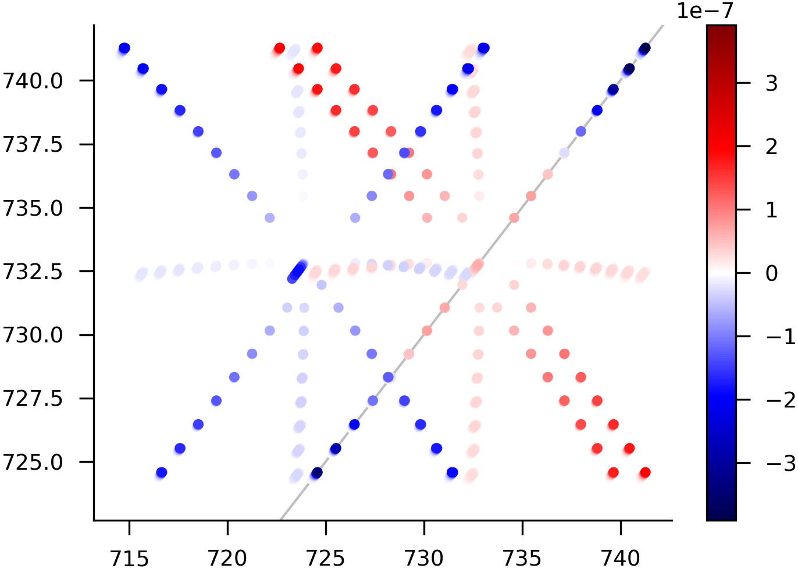

.. currentmodule:: rotsim2d.dressedleaf

Manipulating individual excitation pathways
-------------------------------------------

You can download `.py` file containing all the code for this section
:download:`here <doctests/tutorial_rotsim2d.dressedleaf.py>`.

Individual abstract pathways
++++++++++++++++++++++++++++

:class:`Pathway` represents an individual excitation pathway (a double-sided
Feynmann diagram) not associated with any specific molecular vibrational
mode. It can be instantiated with a leaf node of
:class:`rotsim2d.pathways.KetBra` excitation tree:

.. testcode::

   import rotsim2d.pathways as pw
   import rotsim2d.dressedleaf as dl
   import molspecutils.molecule as mol
   kb1 = pw.KetBra(mol.DiatomState(nu=0, j=1), mol.DiatomState(nu=0, j=1))
   kb1 = pw.multi_excite(kb2, light_names=['omg1', 'omg2', 'omg3'],
                         parts=['ket', 'both', 'both'],
                         light_angles=[0]*3)
   kb1 = pw.readout(kb1)
   pw1 = dl.Pathway(kb1.leaves[0])
   pw1.pprint()

.. testoutput::

   diagram:                                    
   <-|0,1><0,1|                                
   ->|1,0><0,1|                                
   <-|0,1><0,1|                                
   ->|1,0><0,1|                                
     |0,1><0,1|                                
   G-factor label: PRP                         
   Transition chain label: PPP                 
   Intensity relative to XXXX polarization: 1.0

Transition chain label classifies the transitions induced by each light interaction by a sequence of three letters: P, Q or R. This is the same notation as the one used in [1]_.  

A list of all pathways in a given excitation tree can be obtained by using the class method :meth:`Pathway.from_kb_tree`:

>>> pws1 = dl.Pathway.from_kb_tree(kb1)
>>> print(pws1[:2])
... [Pathway(leaf=Ketbra(DiatomState(nu=0, j=1), DiatomState(nu=0, j=1))), Pathway(leaf=Ketbra(DiatomState(nu=0, j=1), DiatomState(nu=0, j=1)))]

With :meth:`Pathway.from_kb_list` we can obtain a list pathways from a list of excitation trees:

>>> js = (0, 1, 2, 3)
>>> kbs = pw.gen_pathways(js, pols=[0]*4, meths=[pw.only_SII, pw.only_twocolor],
...                       rotor='symmetric', kiter_func=lambda j: range(j+1))
>>> pws2 = dl.Pathway.from_kb_list(kbs)

Such potentially long list of pathways can be classified by 2D peaks they
generate and printed out for easier inspection:

.. testcode::

   pws1_by_peaks = dl.split_by_peaks(pws1)
   dl.print_dl_dict(pws1_by_peaks, fields=['trans_label', 'tw_coherence', 'js'])

.. testoutput::

   ('|1,0><0,1|', '|1,0><0,1|')                                                                 
       Pathway(trans_label=PPP, tw_coherence=False, js=(1, 0, 1, 0))                            
       Pathway(trans_label=PRR, tw_coherence=True, js=(1, 0, 1, 0))                             
       Pathway(trans_label=PPP, tw_coherence=False, js=(1, 0, 1, 0))                            
       Pathway(trans_label=PRR, tw_coherence=True, js=(1, 2, 1, 0))                             
   ('|1,0><0,1|', '|1,2><0,1|')                                                                 
       Pathway(trans_label=PPR, tw_coherence=False, js=(1, 2, 1, 0))                            
       Pathway(trans_label=PRP, tw_coherence=True, js=(1, 2, 1, 0))                             
   ('|1,0><0,1|', '|0,1><1,0|')                                                                 
       Pathway(trans_label=PPP, tw_coherence=False, js=(1, 0, 1, 0))                            
       Pathway(trans_label=PPP, tw_coherence=False, js=(1, 0, 1, 0))                            
   ('|1,0><0,1|', '|0,1><1,2|')                                                                 
       Pathway(trans_label=PPR, tw_coherence=False, js=(1, 2, 1, 0))                            
       Pathway(trans_label=PRP, tw_coherence=True, js=(1, 2, 1, 0))                             
   ('|1,0><0,1|', '|2,1><1,0|')                                                                 
       Pathway(trans_label=PRP, tw_coherence=True, js=(1, 0, 1, 0))                             
       Pathway(trans_label=PPR, tw_coherence=False, js=(1, 0, 1, 0))                            
   ('|1,0><0,1|', '|2,1><1,2|')                                                                 
       Pathway(trans_label=PRR, tw_coherence=True, js=(1, 2, 1, 0))                             
       Pathway(trans_label=PRR, tw_coherence=True, js=(1, 2, 1, 0))                             
   ('|1,0><0,1|', '|1,0><2,1|')                                                                 
       Pathway(trans_label=PPR, tw_coherence=False, js=(1, 0, 1, 0))                            
       Pathway(trans_label=PRP, tw_coherence=True, js=(1, 2, 1, 0))                             
   ('|1,2><0,1|', '|1,0><0,1|')                                                                 
       Pathway(trans_label=RRP, tw_coherence=False, js=(1, 0, 1, 2))                            
       Pathway(trans_label=RPR, tw_coherence=True, js=(1, 0, 1, 2))                             
   ('|1,2><0,1|', '|1,2><0,1|')                                                                 
       Pathway(trans_label=RRR, tw_coherence=False, js=(1, 2, 1, 2))                            
       Pathway(trans_label=RPP, tw_coherence=True, js=(1, 2, 3, 2))                             
       Pathway(trans_label=RPP, tw_coherence=True, js=(1, 2, 1, 2))                             
       Pathway(trans_label=RRR, tw_coherence=True, js=(1, 2, 3, 2))                             
       Pathway(trans_label=RPP, tw_coherence=True, js=(1, 0, 1, 2))                             
       Pathway(trans_label=RRR, tw_coherence=False, js=(1, 2, 1, 2))                            
   ('|1,2><0,1|', '|0,1><1,0|')                                                                 
       Pathway(trans_label=RRP, tw_coherence=False, js=(1, 0, 1, 2))                            
       Pathway(trans_label=RPR, tw_coherence=True, js=(1, 0, 1, 2))                             
   ('|1,2><0,1|', '|0,1><1,2|')                                                                 
       Pathway(trans_label=RRR, tw_coherence=False, js=(1, 2, 1, 2))                            
       Pathway(trans_label=RRR, tw_coherence=False, js=(1, 2, 1, 2))                            
   ('|1,2><0,1|', '|0,3><1,2|')                                                                 
       Pathway(trans_label=RPR, tw_coherence=True, js=(1, 2, 3, 2))                             
       Pathway(trans_label=RRP, tw_coherence=False, js=(1, 2, 3, 2))                            
   ('|1,2><0,1|', '|2,1><1,0|')                                                                 
       Pathway(trans_label=RPP, tw_coherence=True, js=(1, 0, 1, 2))                             
       Pathway(trans_label=RPP, tw_coherence=True, js=(1, 0, 1, 2))                             
   ('|1,2><0,1|', '|2,1><1,2|')                                                                 
       Pathway(trans_label=RPR, tw_coherence=True, js=(1, 2, 1, 2))                             
       Pathway(trans_label=RRP, tw_coherence=False, js=(1, 2, 1, 2))                            
   ('|1,2><0,1|', '|2,3><1,2|')                                                                 
       Pathway(trans_label=RRR, tw_coherence=True, js=(1, 2, 3, 2))                             
       Pathway(trans_label=RRR, tw_coherence=False, js=(1, 2, 3, 2))                            
   ('|1,2><0,1|', '|1,2><2,1|')                                                                 
       Pathway(trans_label=RPR, tw_coherence=True, js=(1, 0, 1, 2))                             
       Pathway(trans_label=RRP, tw_coherence=False, js=(1, 2, 1, 2))                            
   ('|1,2><0,1|', '|1,2><0,3|')                                                                 
       Pathway(trans_label=RRP, tw_coherence=False, js=(1, 2, 3, 2))                            
   ('|1,2><0,1|', '|1,2><2,3|')                                                                 
       Pathway(trans_label=RRR, tw_coherence=False, js=(1, 2, 3, 2))                            

`tw_coherence` tells whether the system is in a coherence state or population
state between second and third pulse. `fields` argument determines what
information is printed for each pathway. Valid field names are defined in
:attr:`Pathway.fields`.

Pathways associated with vibrational modes
++++++++++++++++++++++++++++++++++++++++++

To associate a pathway with some concrete vibrational mode, we need an instance
of a class implementing the :class:`molspecutils.molecule.VibrationalMode`
interface.  Two such classes are :class:`molspecutils.molecule.COAlchemyMode`
and :class:`molspecutils.molecule.CH3ClAlchemyMode`. Let's use the latter:

.. testcode::

   from molspecutils.molecule import CH3ClAlchemyMode

   ch3cl_mode = CH3ClAlchemyMode()
   kbs = pw.gen_pathways(range(1, 10), pols=[0]*4, meths=[pw.only_SII, pw.only_twocolor],       
                         rotor='symmetric', kiter_func=lambda x: range(x if x<10 else 10))        
   dressed_pws = dl.DressedPathway.from_kb_list(kbs, ch3cl_mode, 296.0)                    
   peaks, dls = dl.peak_list(dressed_pws, return_dls=True)                                 
   fig_dict = vis.plot2d_scatter(peaks)                                                    
   fig_dict['fig'].savepng('images/ch3cl_2d_plot.png')                                    

As before, we can filter the excitation tree with functions from
:mod:`rotsim2d.pathways`. We can also investigate the polarization dependence by
changing the value of the `pols` argument, which takes a sequence of four angles
corresponding to polarizations of three interaction pulses and the detection
polarization. :func:`rotsim2d.visual.plot2d_scatter` is a convenience functions
for plotting a list of 2D peaks.
	   
.. [1] D. Murdock, L. A. Burns, P. H. Vaccaro. J. Phys. Chem. A 113, 13184-13198 (2009). doi:10.1021/jp903970d.
