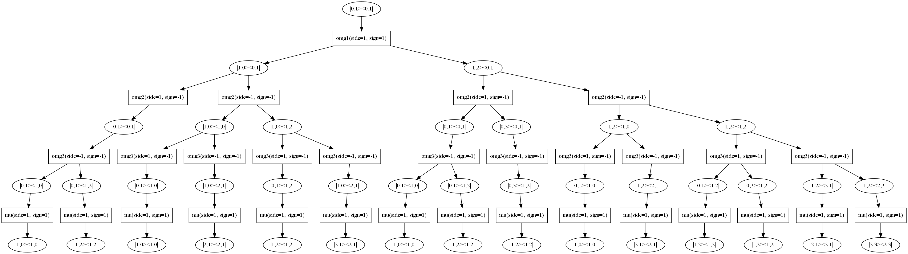

.. currentmodule:: rotsim2d.pathways

Creating and manipulating excitation tree
-----------------------------------------

You can download `.py` file containing all the code for this section
:download:`here <doctests/tutorial_rotsim2d.pathways.py>`.

First-order excitation
++++++++++++++++++++++

Create :class:`KetBra` in ground vibrational state

.. testcode::
   
   import rotsim2d.pathways as pw
   import molspecutils.molecule as mol
   kb1 = pw.KetBra(mol.DiatomState(nu=0, j=1), mol.DiatomState(nu=0, j=1))
   print(kb1)

.. testoutput::

   |0,1><0,1|

and excite it,

.. testcode::

   pw.excite(kb1, light_name='omg1')
   kb1.print_tree()
   
.. testoutput::

   |0,1><0,1|
   └── omg1
       ├── |1,0><0,1|
       └── |1,2><0,1|
   
`kb1` is modified in-place. Use :func:`readout` to simulate measurement and see which
branches will contribute to macroscopic polarization, i.e. would survive
another one-sided application of the dipole operator and taking the trace of the
density matrix.

.. testcode::

   pw.readout(kb1)
   kb1.print_tree()

.. testoutput::

   |0,1><0,1|
   └── omg1
       ├── |1,0><0,1|
       │   └── mu
       │       └── |0,1><0,1|
       └── |1,2><0,1|
           └── mu
               └── |0,1><0,1|

Third-order excitation
++++++++++++++++++++++

Create :class:`KetBra` in ground vibrational state and perform three excitations with :func:`multi_excite`:

.. testcode::

   kb2 = pw.KetBra(mol.DiatomState(nu=0, j=1), mol.DiatomState(nu=0, j=1))
   kb2 = pw.multi_excite(kb1, light_names=['omg1', 'omg2', 'omg3'],
                         parts=['ket', 'both', 'both'],
                         light_angles=[0]*3)
   kb2.print_tree()

.. testoutput::

   |0,1><0,1|
   └── omg1
       ├── |1,0><0,1|
       │   ├── omg2
       │   │   └── |0,1><0,1|
       │   │       ├── omg3
       │   │       │   ├── |1,0><0,1|
       │   │       │   └── |1,2><0,1|
       │   │       └── omg3
       │   │           ├── |0,1><1,0|
       │   │           └── |0,1><1,2|
   # cut off, excitation tree is very long

The excitation tree in this case is very long.  We can save it's graphical
representation with :meth:`KetBra.savepng`. This uses
:class:`anytree.exporter.DotExporter` and requires a working installation of
`GraphViz <https://graphviz.org/>`_.

.. testcode::

   kb2.save_png('images/kb2.png')

We can also generate double-sided Feynmann diagrams corresponding to the tree with LaTeX/Tikz:

.. testcode::

   import rotsim2d.visual as vis
   latex_code = vis.tikz_diagrams(kb2)
   vis.latex_compile('../images/kb2_tikz.tex', vis.LATEX_PRE + latex_code + vis.LATEX_POST)

See the result: :download:`kb2_tikz.pdf <images/kb2_tikz.pdf>`. See
:func:`rotsim2d.visual.tikz_diagrams` for more details.

Filtering the tree
++++++++++++++++++

`kb2` contains all rephasing and non-rephasing pathways, emitted in all directions.  The tree can be filtered with one of :mod:`rotsim2d.pathways` functions startin with `remove_` or only `only_`.  For example, to obtain only pathways emitted in :math:`\vec{k}_s = \vec{k}_1 - \vec{k_2} + \vec{k}_3` (non-rephasing pathways) we can use:

.. testcode::

   kb2 = pw.only_SII(kb2)
   kb2 = pw.readout(kb2)
   kb2.savepng('../images/kb2_SII.png')

For :math:`\vec{k}_s = \vec{k}_1 + \vec{k_2} - \vec{k}_3` direction (rephasing
without double-quantum coherences), we can use:

.. testcode::

   kb2 = pw.only_SI(kb2)
   kb2 = pw.readout(kb2)
   kb2.savepng('../images/kb2_SI.png')

   
Multiple excitations tree
+++++++++++++++++++++++++

Excitation trees for many initial `j` values can be generated with :func:`gen_pathways`:

.. testcode::

   from pprint import pprint
   js = (0, 1, 2, 3)
   kbs = pw.gen_pathways(js, pols=[0]*4, meths=[pw.only_SII, pw.only_twocolor],
                         rotor='symmetric', kiter_func=lambda j: range(j+1))
   pprint(kbs)

.. testoutput::

   [Ketbra(SymTopState(nu=0, j=0, k=0), SymTopState(nu=0, j=0, k=0)),
   Ketbra(SymTopState(nu=0, j=1, k=0), SymTopState(nu=0, j=1, k=0)),
   Ketbra(SymTopState(nu=0, j=1, k=1), SymTopState(nu=0, j=1, k=1)),
   Ketbra(SymTopState(nu=0, j=2, k=0), SymTopState(nu=0, j=2, k=0)),
   Ketbra(SymTopState(nu=0, j=2, k=1), SymTopState(nu=0, j=2, k=1)),
   Ketbra(SymTopState(nu=0, j=2, k=2), SymTopState(nu=0, j=2, k=2)),
   Ketbra(SymTopState(nu=0, j=3, k=0), SymTopState(nu=0, j=3, k=0)),
   Ketbra(SymTopState(nu=0, j=3, k=1), SymTopState(nu=0, j=3, k=1)),
   Ketbra(SymTopState(nu=0, j=3, k=2), SymTopState(nu=0, j=3, k=2)),
   Ketbra(SymTopState(nu=0, j=3, k=3), SymTopState(nu=0, j=3, k=3))]

This call created a list of third-order excitation trees for `j` values in
`js`. Each tree was filtered by :func:`only_SII` and
:func:`only_twocolor`. `meths` argument can contain any callable that takes
:class:`KetBra` instance as its sole argument and returns it, presumably after
filtering it in some way.  `rotor='symmetric'` causes the functions to generate
tree for different `k` quantum number values. The range of these values is
determined by `kiter_func`, which takes the current `j` value and returns an
iterable over `k` numbers.  By default it iterates from 0 to `j`.
